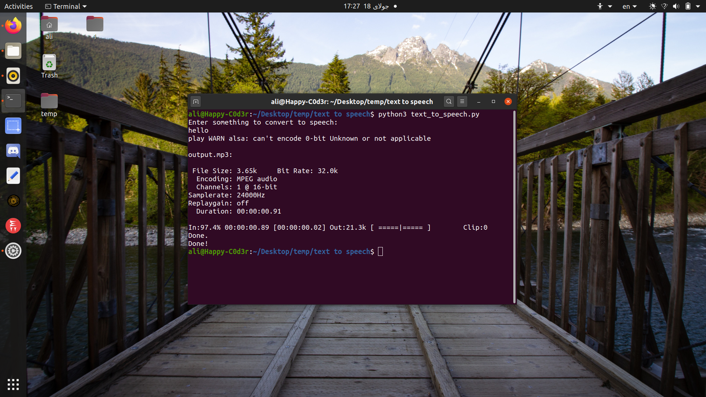

# Text to Speech

## Description
a little script that coverts text to speech with python.

## Table of Contents
* [Installing](https://github.com/ali-moments/text-to-speech#installing)
* [Usage](https://github.com/ali-moments/text-to-speech#usage)
* [ScreenShot](https://github.com/ali-moments/text-to-speech#screenshot)
* [Contributing](https://github.com/ali-moments/text-to-speech#contributing)
* [Credits](https://github.com/ali-moments/text-to-speech#credits)
* [License](https://github.com/ali-moments/text-to-speech#license)

## Installing
```bash
sudo apt install git
git clone https://github.com/ali-moments/text-to-speech.git
cd text-to-speech
sudo chmod +x install.sh
sudo ./install.sh
```

## Usage
just run it with python
```bash
python3 text_to_speech.py
```
or write your text in a text file and save it as test.txt then run this one:
```bash
python3 textfile_to_speech.py
```

## ScreenShot


## Credits
Ali-AAA
[](https://t.me/happy_c0d3r)
[](https://www.instagram.com/ali_aaa_3351/)

## License

